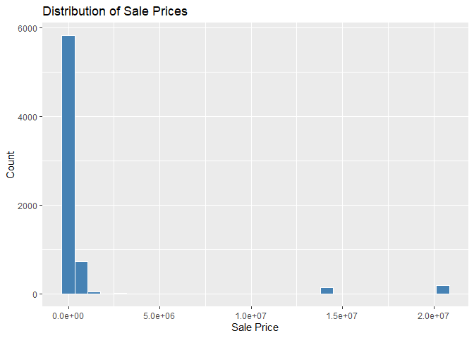
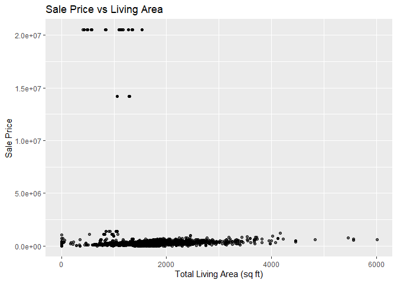

<!-- README.md is generated from README.Rmd. Please edit the README.Rmd file -->

# Lab report \#1

Follow the instructions posted at
<https://ds202-at-isu.github.io/labs.html> for the lab assignment. The
work is meant to be finished during the lab time, but you have time
until Monday evening to polish things.

Include your answers in this document (Rmd file). Make sure that it
knits properly (into the md file). Upload both the Rmd and the md file
to your repository.

All submissions to the github repo will be automatically uploaded for
grading once the due date is passed. Submit a link to your repository on
Canvas (only one submission per team) to signal to the instructors that
you are done with your submission.

**Aniroop’s Work:**

This analysis explores residential home sales in Ames since 2017. The
distribution of SalePrice is right-skewed, with most homes selling
between \$150,000 and \$350,000. Larger homes tend to sell for higher
prices. We examined the relationship between living area and sale price
and found a strong positive relationship.

**Inspecting the Dataset:**

``` r
library(classdata)
library(tidyverse)
```

    ## ── Attaching core tidyverse packages ──────────────────────── tidyverse 2.0.0 ──
    ## ✔ dplyr     1.1.4     ✔ readr     2.1.6
    ## ✔ forcats   1.0.1     ✔ stringr   1.6.0
    ## ✔ ggplot2   4.0.1     ✔ tibble    3.3.1
    ## ✔ lubridate 1.9.4     ✔ tidyr     1.3.2
    ## ✔ purrr     1.2.1     
    ## ── Conflicts ────────────────────────────────────────── tidyverse_conflicts() ──
    ## ✖ dplyr::filter() masks stats::filter()
    ## ✖ dplyr::lag()    masks stats::lag()
    ## ℹ Use the conflicted package (<http://conflicted.r-lib.org/>) to force all conflicts to become errors

``` r
data(ames)

head(ames)
```

    ## # A tibble: 6 × 16
    ##   `Parcel ID` Address      Style Occupancy `Sale Date` `Sale Price` `Multi Sale`
    ##   <chr>       <chr>        <fct> <fct>     <date>             <dbl> <chr>       
    ## 1 0903202160  1024 RIDGEW… 1 1/… Single-F… 2022-08-12        181900 <NA>        
    ## 2 0907428215  4503 TWAIN … 1 St… Condomin… 2022-08-04        127100 <NA>        
    ## 3 0909428070  2030 MCCART… 1 St… Single-F… 2022-08-15             0 <NA>        
    ## 4 0923203160  3404 EMERAL… 1 St… Townhouse 2022-08-09        245000 <NA>        
    ## 5 0520440010  4507 EVERES… <NA>  <NA>      2022-08-03        449664 <NA>        
    ## 6 0907275030  4512 HEMING… 2 St… Single-F… 2022-08-16        368000 <NA>        
    ## # ℹ 9 more variables: YearBuilt <dbl>, Acres <dbl>,
    ## #   `TotalLivingArea (sf)` <dbl>, Bedrooms <dbl>,
    ## #   `FinishedBsmtArea (sf)` <dbl>, `LotArea(sf)` <dbl>, AC <chr>,
    ## #   FirePlace <chr>, Neighborhood <fct>

``` r
glimpse(ames)
```

    ## Rows: 6,935
    ## Columns: 16
    ## $ `Parcel ID`             <chr> "0903202160", "0907428215", "0909428070", "092…
    ## $ Address                 <chr> "1024 RIDGEWOOD AVE, AMES", "4503 TWAIN CIR UN…
    ## $ Style                   <fct> 1 1/2 Story Frame, 1 Story Frame, 1 Story Fram…
    ## $ Occupancy               <fct> Single-Family / Owner Occupied, Condominium, S…
    ## $ `Sale Date`             <date> 2022-08-12, 2022-08-04, 2022-08-15, 2022-08-0…
    ## $ `Sale Price`            <dbl> 181900, 127100, 0, 245000, 449664, 368000, 0, …
    ## $ `Multi Sale`            <chr> NA, NA, NA, NA, NA, NA, NA, NA, NA, NA, NA, NA…
    ## $ YearBuilt               <dbl> 1940, 2006, 1951, 1997, NA, 1996, 1960, 2006, …
    ## $ Acres                   <dbl> 0.109, 0.027, 0.321, 0.103, 0.287, 0.494, 0.17…
    ## $ `TotalLivingArea (sf)`  <dbl> 1030, 771, 1456, 1289, NA, 2223, 1165, 658, 13…
    ## $ Bedrooms                <dbl> 2, 1, 3, 4, NA, 4, 5, 1, 3, 4, 4, 2, 2, 3, 2, …
    ## $ `FinishedBsmtArea (sf)` <dbl> NA, NA, 1261, 890, NA, NA, 906, NA, NA, 500, 5…
    ## $ `LotArea(sf)`           <dbl> 4740, 1181, 14000, 4500, 12493, 21533, 7500, 1…
    ## $ AC                      <chr> "Yes", "Yes", "Yes", "Yes", "No", "Yes", "Yes"…
    ## $ FirePlace               <chr> "Yes", "No", "No", "No", "No", "Yes", "Yes", "…
    ## $ Neighborhood            <fct> (28) Res: Brookside, (55) Res: Dakota Ridge, (…

The Ames dataset contains information on residential property sales in
Ames, Iowa.  
The variables include both numeric and categorical types. Numerical
variables measure quantities such as price and square footage, while
categorical variable represent classifications like neigbhorhood or
house style.

**Step 2: Main Variable**

The main variable for this analysis is \*\*SalePrice\*\*, which
represents the final selling price of a home.  
  
SalePrice is a numeric variable measured in dollars. Typical values
range from around \$100,000 to over \$500,000 depending on the size,
condition, and location of the home.

**Step 3: Distribution of SalePrice**

``` r
ggplot(ames, aes(x = `Sale Price`)) +
  geom_histogram(bins = 30, fill = "steelblue", color = "white") +
  labs(
    title = "Distribution of Sale Prices",
    x = "Sale Price",
    y = "Count"
  )
```

<!-- -->

The histogram shows that sale prices are right skewed.

**Step 4: Relationship Between Living Area and Sale Price**

``` r
ggplot(filter(ames, `Sale Price` > 0),
       aes(x = `TotalLivingArea (sf)`, y = `Sale Price`)) +
  geom_point(alpha = 0.6) +
  labs(
    title = "Sale Price vs Living Area",
    x = "Total Living Area (sq ft)",
    y = "Sale Price"
  )
```

    ## Warning: Removed 365 rows containing missing values or values outside the scale range
    ## (`geom_point()`).

<!-- -->
